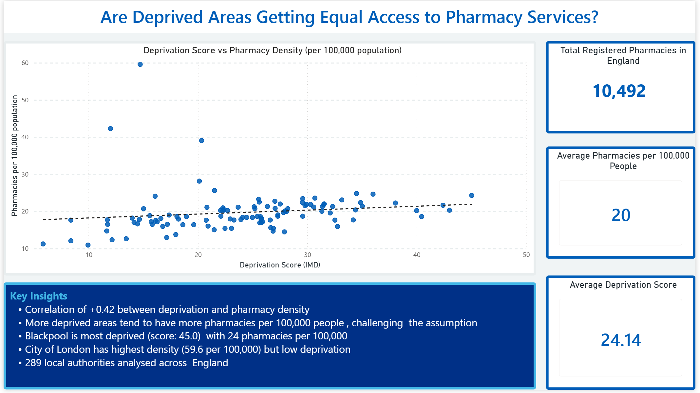
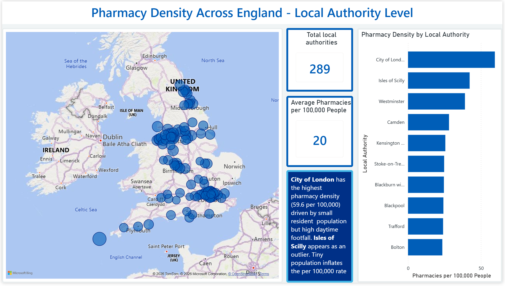
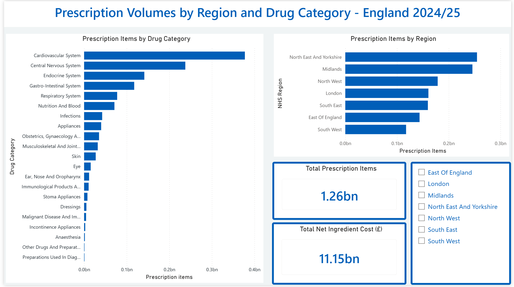
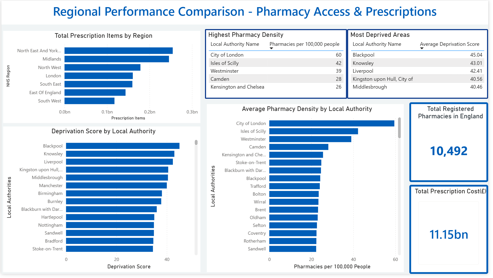

# NHS Pharmacy & Health Access - England 2024/25 Analysis

## Policy Question
Are people in deprived areas getting equal access to pharmacy 
and health services in England?

## Key Findings
- Correlation of +0.15 between deprivation score and pharmacy 
  density - a weak positive relationship suggesting more deprived 
  areas have slightly more pharmacies per 100,000 people
- **Blackpool** is England's most deprived area (IMD score: 45.0) 
  with 24.27 pharmacies per 100,000 people
- **Tower Hamlets and Southampton** show high deprivation but low 
  pharmacy density - areas of genuine access concern
- **City of London** has the highest pharmacy density (59.56 per 
  100,000) driven by a tiny resident population
- Cancer and immunosuppression drugs cost £38.44 per item vs 
  cardiovascular drugs at £3.66 - a 10x difference
- **1.26 billion** prescriptions dispensed in 2024/25
- Total NHS prescription cost: **£11.15 billion**
- **North East & Yorkshire** has the highest prescription volume 
  (254M items) but the lowest cost per item (£7.48)
- **South East** has the highest cost per item (£10.13)
- Very small local authorities (<100k population) have the highest 
  pharmacy density (33.82 per 100,000) - driven by City of London 
  and Isles of Scilly outliers

## Dashboard Pages
| Page | Title | Key Visual |
|---|---|---|
| 1 | Deprivation vs Access | Scatter plot with trend line |
| 2 | Pharmacy Density Map | Bubble map of England |
| 3 | Prescription Trends | Bar charts by region and drug |
| 4 | Regional Comparison | Rankings and summary tables |

## Dashboard Screenshots





## Data Sources
| Dataset | Source | Year |
|---|---|---|
| Prescription Cost Analysis (PCA) | NHS BSA Open Data Portal | 2024/25 |
| Consolidated Pharmaceutical List | NHS BSA | 2025-26 Q4 |
| Index of Multiple Deprivation | ONS / MHCLG | 2019 |
| Population Estimates | ONS | Mid-2024 |

## Tech Stack
| Layer | Technology |
|---|---|
| Storage | Azure Blob Storage (bronze/silver/gold medallion architecture) |
| Secrets management | Azure Key Vault |
| Ingestion | Python, azure-storage-blob |
| Transformation | Python, pandas |
| SQL Analysis | DuckDB |
| Visualisation | Microsoft Power BI Desktop |
| Version control | Git, GitHub |

## Data Pipeline
```
Raw Data (NHS BSA + ONS)
        ↓
Bronze Layer (Azure Blob — raw files as downloaded)
        ↓
Silver Layer (Azure Blob — cleaned, standardised)
        ↓
Gold Layer (Azure Blob — aggregated, analysis-ready)
        ↓
DuckDB SQL Analysis + Power BI Dashboard
```

## Project Structure
```
nhs-pharmacy-access/
├── scripts/
│   ├── ingest/
│   │   ├── test_connection.py       ← verify Azure connection
│   │   └── upload_to_azure.py       ← upload raw data to bronze
│   ├── transform/
│   │   ├── silver_pharmacy.py       ← clean pharmacy locations
│   │   ├── silver_deprivation.py    ← clean deprivation index
│   │   ├── silver_population.py     ← clean population estimates
│   │   ├── silver_prescriptions.py  ← clean prescription data
│   │   ├── gold_pharmacy_deprivation.py ← core analytical table
│   │   ├── gold_prescriptions.py    ← prescription aggregations
│   │   └── gold_regional_summary.py ← regional summary table
│   └── analysis/
│       └── run_sql_analysis.py      ← runs DuckDB SQL queries
├── sql/
│   ├── analysis_deprivation_vs_access.sql
│   ├── analysis_prescriptions_by_region.sql
│   └── analysis_pharmacy_density.sql
├── notebooks/
├── powerbi/
│   └── nhs_pharmacy_dashboard.pbix
├── docs/
├── config/
├── .gitignore
├── requirements.txt
└── README.md
```

## Setup Instructions
```bash
# Clone the repo
git clone https://github.com/YOUR-USERNAME/nhs-pharmacy-access
cd nhs-pharmacy-access

# Create and activate virtual environment
python -m venv venv
venv\Scripts\Activate.ps1       # Windows
source venv/bin/activate         # Mac/Linux

# Install dependencies
pip install -r requirements.txt

# Configure Azure credentials
# Create a .env file with:
# AZURE_STORAGE_ACCOUNT=your_account_name
# AZURE_STORAGE_KEY=your_key_here

# Test Azure connection
python scripts/ingest/test_connection.py

# Run SQL analysis
python scripts/analysis/run_sql_analysis.py
```

## Architecture Decision Notes
Databricks serverless was configured for this project. Due to network 
policy restrictions in the free tier blocking outbound connections to 
Azure Blob Storage, transformations were run locally in Python following 
the same medallion architecture pattern. In a production environment 
this would be resolved using Azure Private Endpoints or VNet peering 
between Databricks and Azure Storage. Databricks notebooks are included 
in /notebooks for documentation and SQL query development.

## Data Citations
NHS Business Services Authority (2025). *Prescription Cost Analysis 
(PCA) Data 2024/25*. NHS Business Services Authority Open Data Portal.
Available at: https://opendata.nhsbsa.net/

NHS Business Services Authority (2025). *Consolidated Pharmaceutical 
List 2025-26 Quarter 4*. NHS Business Services Authority Open Data Portal.
Available at: https://opendata.nhsbsa.net/

Ministry of Housing, Communities & Local Government (2019). 
*English Indices of Deprivation 2019*. GOV.UK.
Available at: https://www.gov.uk/government/statistics/english-indices-of-deprivation-2019

Office for National Statistics (2024). *Population Estimates for 
England and Wales, Mid-2024*. ONS.
Available at: https://www.ons.gov.uk/peoplepopulationandcommunity/populationandmigration/populationestimates

## Licence
Source data is published under the 
[Open Government Licence v3.0](https://www.nationalarchives.gov.uk/doc/open-government-licence/version/3/).
This project is licensed under [MIT](LICENSE).